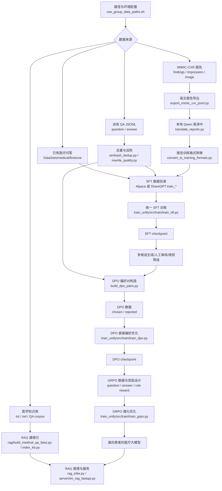

# Medical Fullstack：医疗数据处理、训练对齐与 RAG 服务

`medical_fullstack` 是 `andes_vl` 下围绕医疗大模型构建的端到端工程封装。它先负责把医疗问答、MIMIC-CXR 报告、偏好数据和 RAG 知识库整理成可训练/可服务的形态，再通过 `train_unify` 中的统一训练代码完成 Qwen-VL 多模态 SFT、DPO、GRPO、评测和推理服务。

项目目标是训练一个**面向患者的中文医疗助手**：能用通俗语言解释医疗问题，能识别高风险症状并提醒就医，能保持医疗安全边界，不直接替代医生诊断和处方。

## 功能概览

- **医疗问答 SFT**：直接使用 `DataSets/medical/finetune` 中的 Alpaca 数据，也支持自有 `question/answer` JSONL 转 ShareGPT。
- **医学报告数据处理**：从 MIMIC-CXR 导出英文报告，使用本地 Qwen 翻译为中文，再转换为 Alpaca 或多模态 Qwen-VL 训练格式。
- **统一训练入口**：`train_unify/` 承接原 Qwen-VL 训练工程，提供 SFT、LoRA、DPO、GRPO、医学评测、LoRA 合并和 Gradio 推理。
- **DPO 偏好数据构造**：文本偏好可用 `corpus/build_dpo_pairs.py`，多模态患者偏好可用 `train_unify/scripts/build_medical_dpo_patient_judge.sh`。
- **DPO -> GRPO 对齐主线**：SFT 后先通过 DPO 学习患者医疗助手偏好，再通过 GRPO 强化可验证的安全、grounding、格式和边界约束。
- **RAG 与服务化**：`rag/` 支持医学 QA 检索索引和 RAG 推理，`serve/` 提供 VLM + RAG FastAPI 服务入口。
- **冒烟测试入口**：`run_medical_pipeline.sh` 可用于打印环境、准备小规模 SFT/DPO 数据和构建 RAG 索引；实际训练推荐进入 `train_unify/` 执行对应脚本。

## Pipeline



推荐训练主线是：

```text
数据处理 -> train_unify SFT -> DPO -> GRPO -> RAG/服务化验证
```

CPT 是可选阶段，适合在需要进一步注入领域语料分布时放在 SFT 前；RAG 是服务阶段能力增强，不替代模型训练。当前统一训练代码集中在 `train_unify/`，旧的 `train/*.sh` 可作为文本训练或历史封装参考。

## 目录结构

| 路径 | 说明 |
|:--|:--|
| `corpus/` | 数据处理脚本：MIMIC 导出、报告翻译、去重、润色、格式转换、DPO 偏好对构造 |
| `train_unify/` | 统一多模态训练模块：SFT、DPO、GRPO、医学评测、LoRA 合并、推理 |
| `train/` | 旧训练封装脚本：主要作为文本训练或历史脚本参考 |
| `rag/` | 医疗 QA 检索、FAISS/BM25 索引、RAG 推理与评估 |
| `serve/` | VLM + RAG FastAPI 服务入口 |
| `eval/` | JSONL 结果对比与 BLEU 类评估 |
| `data/` | 中间数据、冒烟数据、DPO/GRPO 示例数据目录 |
| `use_group_data_paths.sh` | 组内机器路径变量 |
| `run_medical_pipeline.sh` | 全流程分步/冒烟入口 |

## 环境与路径

推荐先加载组内路径变量：

```bash
source /home/notebook/data/group/guoyulong/code/image_enhance/vlm-prx/SuperResolution_train_prx/andes_vl/medical_fullstack/use_group_data_paths.sh
```

关键变量：

| 变量 | 默认含义 |
|:--|:--|
| `ANDES_VL_ROOT` | `andes_vl` 根目录 |
| `MEDICAL_FULLSTACK` | 当前 `medical_fullstack` 目录 |
| `MEDICAL_DS` | 医疗数据集目录，默认 `DataSets/medical` |
| `MIMIC_CXR_ROOT` | MIMIC-CXR 数据目录 |
| `MODEL_NAME_OR_PATH` | 基座模型或上阶段 checkpoint |
| `MEDICAL_DATA_ROOT` | `medical_fullstack/data` |

也可以使用一键脚本查看当前环境：

```bash
cd "${MEDICAL_FULLSTACK}"
./run_medical_pipeline.sh print-env
```

训练和数据导出会写入大量 checkpoint、缓存和中间 JSONL，请确保 `/home/notebook/data/group` 所在磁盘有足够空间。

## 新机器复现运行步骤

下面按一台新机器从零复现的顺序说明。完整链路是：`corpus/` 负责把原始问答、MIMIC-CXR 报告和偏好数据整理成训练格式；`train_unify/` 使用同一套 Qwen-VL 训练代码跑纯文本问答、多模态图文 SFT、DPO 和 GRPO；`rag/` 构建医学知识库索引；`serve/` 把微调后的 VLM 与 RAG 检索接成 FastAPI 服务。

### 1. 准备目录、模型和数据

推荐把代码、数据和模型放在同一个 `andes_vl` 根目录下，路径变量和脚本默认都按这个布局解析：

```text
andes_vl/
  medical_fullstack/
  DataSets/
    medical/
      finetune/                 # Alpaca 医疗问答，train_*.json/jsonl
      mixed_sft/                # 生成后的 train_unify 图文 JSON
      reward/                   # 可选，已有偏好对
    mimic-cxr-dataset/          # MIMIC-CXR HF disk/arrow 数据
    mimic-cxr-jpeg-sample200/   # 图像根目录，JSON 中 image 按此相对解析
  models/
    models/Qwen/Qwen3___5-4B/   # 基座模型或上阶段 checkpoint
```

最少需要准备这些内容：

- 基座模型目录，目录下应有 `config.json`、tokenizer 和权重文件。
- 医疗问答数据，已有 `instruction/input/output` Alpaca 格式可放在 `DataSets/medical/finetune`；自有数据推荐整理成 `question/answer` JSONL。
- 多模态训练需要 MIMIC-CXR 报告和图像。若 HF 数据集里图像是内嵌字节，导出时用 `--save_images_dir` 写成 JPEG 文件。
- RAG 需要医学 QA JSONL，或一批 `.txt` / `.md` 医学知识库文件。

加载或覆盖路径变量：

```bash
cd /path/to/andes_vl

# 如果路径与本项目默认路径一致，可直接 source。
source medical_fullstack/use_group_data_paths.sh

# 新机器路径不同，更推荐在当前 shell 覆盖。
export ANDES_VL_ROOT=/path/to/andes_vl
export MEDICAL_FULLSTACK="${ANDES_VL_ROOT}/medical_fullstack"
export MEDICAL_DS="${ANDES_VL_ROOT}/DataSets/medical"
export MIMIC_CXR_ROOT="${ANDES_VL_ROOT}/DataSets/mimic-cxr-dataset"
export MODEL_NAME_OR_PATH="${ANDES_VL_ROOT}/models/models/Qwen/Qwen3___5-4B"
export MEDICAL_DATA_ROOT="${MEDICAL_FULLSTACK}/data"
export MIMIC_REPORT_EN_JSONL="${MEDICAL_DATA_ROOT}/raw/mimic_report_en.jsonl"
export MIMIC_REPORT_ZH_JSONL="${MEDICAL_DATA_ROOT}/clean/mimic_report_zh.jsonl"

cd "${MEDICAL_FULLSTACK}"
./run_medical_pipeline.sh print-env
```

`run_medical_pipeline.sh` 主要用于打印环境、构造小规模冒烟数据和旧文本训练入口；正式多模态训练建议进入 `train_unify/` 执行对应脚本。

### 2. 安装运行环境

建议新建 Python 环境后先安装统一训练依赖：

```bash
cd "${MEDICAL_FULLSTACK}/train_unify"
pip install -r requirements.txt
```

RAG 与服务额外需要：

```bash
pip install faiss-cpu sentence-transformers fastapi uvicorn qwen-vl-utils
```

训练依赖 CUDA、PyTorch 和 DeepSpeed。`train_unify/requirements.txt` 固定了 `torch==2.8.0`、`deepspeed==0.17.5`、`transformers==5.3.0` 等版本；如果新机器 CUDA 版本不一致，先保证 PyTorch 与 GPU 驱动匹配。Qwen3.5 本地脚本默认使用 `--disable_flash_attn2 True`，没有 Flash Attention 时也能走 SDPA。

### 3. 数据处理：从原始数据到训练 JSON

#### 3.1 医疗问答数据

如果只做患者问答，最快路径是直接使用 `DataSets/medical/finetune` 下已有 Alpaca 文件。想进入 `train_unify` 统一训练时，需要转成 JSON 数组，样本格式是 ShareGPT/LLaVA 风格 `conversations`，纯文本样本不需要 `image` 字段：

```json
{
  "conversations": [
    {"from": "human", "value": "感冒发烧应该怎么办？"},
    {"from": "gpt", "value": "建议休息、补充水分并监测体温，如持续高热或症状加重应及时就医。"}
  ]
}
```

自有 `question/answer` JSONL 可先去重、润色，再转 ShareGPT JSONL：

```bash
cd "${MEDICAL_FULLSTACK}/corpus"
mkdir -p "${MEDICAL_FULLSTACK}/data/sft_qa"

python simhash_dedup.py --input /path/to/qa.jsonl --output "${MEDICAL_FULLSTACK}/data/sft_qa/qa_dedup.jsonl" \
  --combine_keys question,answer --max_hamming 3 --keep longest

python rewrite_quality.py --input "${MEDICAL_FULLSTACK}/data/sft_qa/qa_dedup.jsonl" \
  --output "${MEDICAL_FULLSTACK}/data/sft_qa/qa_polish.jsonl" \
  --mode llm --model_name_or_path "${MODEL_NAME_OR_PATH}"

python convert_to_training_formats.py --mode qa_sharegpt \
  --input "${MEDICAL_FULLSTACK}/data/sft_qa/qa_polish.jsonl" \
  --output "${MEDICAL_FULLSTACK}/data/sft_qa/train_qa_sharegpt.jsonl"
```

`qa_sharegpt` 产物是 JSONL，而 `train_unify/src/dataset/sft_dataset.py` 使用 `json.load` 读取 JSON 数组。纯文本问答 SFT 前需再包成数组：

```bash
python - <<'PY'
import json
from pathlib import Path

inp = Path("data/sft_qa/train_qa_sharegpt.jsonl")
out = Path("data/sft_qa/train_qa_sharegpt.json")
rows = [json.loads(line) for line in inp.read_text(encoding="utf-8").splitlines() if line.strip()]
out.write_text(json.dumps(rows, ensure_ascii=False, indent=2), encoding="utf-8")
print({"count": len(rows), "out": str(out)})
PY
```

如果原始问答是 Alpaca `instruction/input/output`，可以先转为 `question/answer` JSONL，`question` 由 `instruction` 与非空 `input` 拼接，`answer` 对应 `output`。

#### 3.2 MIMIC-CXR 报告与图像

导出英文报告。多模态训练需要 JSON 里有可解析的 `image` 字段；如果原数据没有路径，使用 `--save_images_dir` 导出 JPEG，后续 `IMAGE_FOLDER` 指向该目录：

```bash
mkdir -p "${MEDICAL_DATA_ROOT}/raw" "${MEDICAL_DATA_ROOT}/clean" "${MEDICAL_DATA_ROOT}/sft_report"
export MIMIC_JPEG_DIR="${ANDES_VL_ROOT}/DataSets/mimic-cxr-jpeg-sample200"

python "${MEDICAL_FULLSTACK}/corpus/export_mimic_cxr_jsonl.py" \
  --dataset_root "${MIMIC_CXR_ROOT}" \
  --output "${MIMIC_REPORT_EN_JSONL}" \
  --prefer_pyarrow \
  --save_images_dir "${MIMIC_JPEG_DIR}" \
  --max_rows 100
```

用本地 Qwen 翻译 findings 和 impression：

```bash
python "${MEDICAL_FULLSTACK}/corpus/translate_reports.py" \
  --input "${MIMIC_REPORT_EN_JSONL}" \
  --output "${MIMIC_REPORT_ZH_JSONL}" \
  --model_name_or_path "${MODEL_NAME_OR_PATH}" \
  --id_key row_idx
```

`translate_reports.py` 会逐条翻译 findings 和 impression，没有 `--batch_size` 参数；全量 MIMIC 会产生大量生成调用，先用 `--max_rows` 小样本确认格式和速度。

报告可先转为 Alpaca 纯文本 SFT：

```bash
python "${MEDICAL_FULLSTACK}/corpus/convert_to_training_formats.py" \
  --mode report_alpaca \
  --input "${MIMIC_REPORT_ZH_JSONL}" \
  --output "${MEDICAL_DATA_ROOT}/sft_report/train_mimic_report_zh.jsonl"
```

#### 3.3 生成多模态混合 SFT JSON

`train_unify` 的多模态训练文件应是 JSON 数组，顶层 `image` 是相对 `--image_folder` 的路径，对话里用 `<image>` 占位。混合 QA 与报告时，`cpt_qwen_vl_json` 的前若干 `--input` 应是原始 `question/answer` QA JSONL，最后一个 `--input` 是带中文报告和图像字段的报告 JSONL：

```bash
mkdir -p "${MEDICAL_DS}/mixed_sft"

python "${MEDICAL_FULLSTACK}/corpus/convert_to_training_formats.py" \
  --mode cpt_qwen_vl_json \
  --input "${MEDICAL_FULLSTACK}/data/sft_qa/qa_polish.jsonl" \
  --input "${MIMIC_REPORT_ZH_JSONL}" \
  --output "${MEDICAL_DS}/mixed_sft/train_qa_report_qwen_vl.json" \
  --qa_placeholder_image placeholder.jpg
```

`--qa_placeholder_image` 需要是一张存在于 `IMAGE_FOLDER` 下的小图，用于避免同一 batch 内有图和无图样本混合时 collator 报错。若只训练报告图文样本，可不传 QA 输入和占位图。

### 4. 冒烟验证

先用内置流水线确认路径变量和旧文本入口能跑通：

```bash
cd "${MEDICAL_FULLSTACK}"
./run_medical_pipeline.sh print-env
./run_medical_pipeline.sh prepare-smoke-sft
```

`prepare-smoke-sft` 只是从 `DataSets/medical/finetune` 截取小文件，主要用于旧 `train/*.sh` 文本入口。验证 `train_unify` 时，应使用第 3 步生成的 JSON 数组格式；可以先用 `--max_rows 100`、`MAX_SAMPLES=100` 生成小规模 `mixed_sft`，再跑一轮单卡小 batch：

```bash
cd "${MEDICAL_FULLSTACK}/train_unify"
export DATA_JSON="${MEDICAL_DS}/mixed_sft/train_qa_report_qwen_vl.json"
export IMAGE_FOLDER="${ANDES_VL_ROOT}/DataSets/mimic-cxr-jpeg-sample200"
export MODEL_DIR="${MODEL_NAME_OR_PATH}"
export OUTPUT_DIR="${PWD}/output/qwen35_4b_medical_sft_smoke"
export NUM_DEVICES=1
export BATCH_PER_DEVICE=1
export GLOBAL_BATCH_SIZE=1
export SAVE_AND_EVAL_EVERY=20
bash scripts/finetune_qwen35_4b_local_medical_sft.sh
```

如果只想验证旧文本入口，也可以执行 `./run_medical_pipeline.sh sft-smoke`；正式训练仍以 `train_unify` 为主。

### 5. 进入 train_unify 统一训练

统一训练入口都在 `train_unify/` 下执行：

```bash
cd "${MEDICAL_FULLSTACK}/train_unify"
export PYTHONPATH="${PWD}/src:${PYTHONPATH:-}"
export ANDES_VL_ROOT="$(cd ../.. && pwd)"
```

#### 5.1 单模态问答 SFT

纯文本问答也走 `src/train/train_sft.py`。训练 JSON 必须是数组文件，样本没有 `image` 字段即可；`--image_folder` 可以保留为任意存在的图像目录，模型前向会用 dummy visual 分支兼容纯文本 batch：

```bash
deepspeed --num_gpus=1 src/train/train_sft.py \
  --use_liger_kernel False \
  --deepspeed scripts/zero3_offload.json \
  --model_id "${MODEL_NAME_OR_PATH}" \
  --data_path "${MEDICAL_FULLSTACK}/data/sft_qa/train_qa_sharegpt.json" \
  --image_folder "${ANDES_VL_ROOT}/DataSets/mimic-cxr-jpeg-sample200" \
  --remove_unused_columns False \
  --freeze_vision_tower True \
  --freeze_llm False \
  --freeze_merger True \
  --bf16 True \
  --fp16 False \
  --disable_flash_attn2 True \
  --output_dir output/qwen35_medical_qa_sft \
  --num_train_epochs 1 \
  --per_device_train_batch_size 1 \
  --gradient_accumulation_steps 8 \
  --lazy_preprocess True \
  --save_strategy steps \
  --save_steps 100 \
  --dataloader_num_workers 2
```

#### 5.2 多模态医学混合 SFT

```bash
export DATA_JSON="${MEDICAL_DS}/mixed_sft/train_qa_report_qwen_vl.json"
export IMAGE_FOLDER="${ANDES_VL_ROOT}/DataSets/mimic-cxr-jpeg-sample200"
export MODEL_DIR="${MODEL_NAME_OR_PATH}"
export OUTPUT_DIR="${PWD}/output/qwen35_4b_medical_sft"
export NUM_DEVICES=1
export BATCH_PER_DEVICE=1
export GLOBAL_BATCH_SIZE=8
export SAVE_AND_EVAL_EVERY=50
bash scripts/finetune_qwen35_4b_local_medical_sft.sh
```

脚本会调用 `src/train/train_sft.py`，默认全量训练视觉塔、LLM 和 merger，并在保存 checkpoint 时运行医学 BLEU/ROUGE 评测。显存不足时优先降低 `BATCH_PER_DEVICE`、`GLOBAL_BATCH_SIZE`、`image_max_pixels`，或改用 LoRA 脚本。

#### 5.3 胸片 grounding 分支

grounding 分支会从报告图文 JSON 构造「全图 + 区域 crop」样本，再用 LoRA 训练带 reasoning 的胸片定位任务：

```bash
export INPUT_JSON="${MEDICAL_DS}/mixed_sft/train_qa_report_qwen_vl.json"
export IMAGE_FOLDER="${ANDES_VL_ROOT}/DataSets/mimic-cxr-jpeg-sample200"
export MAX_SAMPLES=200
bash scripts/build_xray_grounding_sft.sh

export DATA_JSON="${PWD}/output/xray_grounding_cot_sft.json"
export MODEL_DIR="${MODEL_NAME_OR_PATH}"
export OUTPUT_DIR="${PWD}/output/qwen35_xray_grounding_cot_lora"
export NUM_DEVICES=1
export BATCH_PER_DEVICE=1
bash scripts/finetune_qwen35_xray_grounding_cot.sh
```

### 6. DPO 与 GRPO 对齐

DPO 放在 SFT 之后，用来学习同一问题下更安全、更准确、更像患者助手的回答偏好。文本偏好数据可用 `corpus/build_dpo_pairs.py` 从已有 `answer_rejected` 构造；如果只是打通流程，可以用 `synthetic_trunc` 做弱负例，但正式医疗对齐应使用人工审核、规则筛选或 judge 模型构造的偏好对：

```bash
cd "${MEDICAL_FULLSTACK}/corpus"
mkdir -p "${MEDICAL_FULLSTACK}/data/dpo"

python build_dpo_pairs.py \
  --input "${MEDICAL_FULLSTACK}/data/sft_qa/qa_polish.jsonl" \
  --output "${MEDICAL_FULLSTACK}/data/dpo/train_dpo_qa.jsonl" \
  --scenario qa \
  --mode explicit
```

多模态患者偏好推荐使用 `train_unify` 的 judge 脚本：

```bash
cd "${MEDICAL_FULLSTACK}/train_unify"
export SFT_JSON="${MEDICAL_DS}/mixed_sft/train_qa_report_qwen_vl.json"
export IMAGE_FOLDER="${ANDES_VL_ROOT}/DataSets/mimic-cxr-jpeg-sample200"
export VL_MODEL_PATH="${PWD}/output/qwen35_4b_medical_sft"
export JUDGE_MODEL_PATH="${MODEL_NAME_OR_PATH}"
export OUT_JSON="${PWD}/output/medical_dpo_patient_judged.json"
export MAX_SAMPLES=100
bash scripts/build_medical_dpo_patient_judge.sh
```

训练 DPO 时将 `scripts/finetune_dpo.sh` 中的 `--model_id` 指向 SFT checkpoint，`--data_path` 指向 DPO JSON，`--image_folder` 指向图像目录，然后启动：

```bash
bash scripts/finetune_dpo.sh
```

GRPO 放在 DPO 后，适合强化能被规则或 reward 稳定验证的行为，例如胸片 grounding 判断、输出格式、红旗症状提醒和医疗边界。当前 reward 实现在 `train_unify/src/train/reward_funcs.py`：

```bash
# 先准备与 reward 对齐的 JSON 数据，再修改 finetune_grpo.sh 的 data_path/model_id/image_folder。
bash scripts/finetune_grpo.sh
```

### 7. 构建 RAG 索引

医学 QA 语料推荐构建新的 FAISS/BM25 混合索引：

```bash
cd "${ANDES_VL_ROOT}"
mkdir -p medical_fullstack/rag/indexes

python medical_fullstack/rag/build_medical_qa_faiss.py \
  --data_jsonl DataSets/medical/finetune/train_zh_0_sample100_rewrite_llm.jsonl \
  --out_dir medical_fullstack/rag/indexes/medical_qa_bge_m3_faiss \
  --embedding_model BAAI/bge-m3 \
  --device cuda:0
```

测试检索和 RAG prompt：

```bash
python medical_fullstack/rag/medical_qa_rag.py \
  --index_dir medical_fullstack/rag/indexes/medical_qa_bge_m3_faiss \
  --query "宫颈糜烂用什么手术治疗比较好？" \
  --top_k 8 \
  --rerank_top_n 3 \
  --device cuda:0 \
  --reranker_device cuda:0 \
  --print_prompt_only
```

如果只有 `.txt` / `.md` 知识库，也可以用旧的轻量索引：

```bash
KB_DIR=/path/to/kb OUT_PKL="${MEDICAL_FULLSTACK}/rag/indexes/medical_kb.pkl" \
  "${MEDICAL_FULLSTACK}/run_medical_pipeline.sh" rag-index
```

### 8. 启动 VLM + RAG 服务

服务入口是 `serve/run_vlm_rag_server.sh`，必须设置微调后模型路径。`RAG_INDEX_DIR` 使用新的 QA FAISS 索引；如果只设置 `RAG_INDEX_PKL`，服务会走旧 pkl 检索：

```bash
cd "${ANDES_VL_ROOT}"
export VLM_MODEL_PATH="${MEDICAL_FULLSTACK}/train_unify/output/qwen35_4b_medical_sft"
export RAG_INDEX_DIR="${MEDICAL_FULLSTACK}/rag/indexes/medical_qa_bge_m3_faiss"
export RAG_EMBED_DEVICE=cuda:0
export RAG_RERANKER_DEVICE=cuda:0
export VLM_DEVICE=cuda
export HOST=0.0.0.0
export PORT=8088

# 无 flash-attn 时可加：export VLM_DISABLE_FLASH=1
# 显存紧时可加：export VLM_LOAD_4BIT=1
bash medical_fullstack/serve/run_vlm_rag_server.sh
```

健康检查和推理示例：

```bash
curl http://127.0.0.1:8088/health

curl -X POST http://127.0.0.1:8088/v1/infer \
  -H 'Content-Type: application/json' \
  -d '{"query":"高血压患者突然胸痛怎么办？","use_rag":true,"top_k":4,"max_new_tokens":512}'
```

若需要图像输入，在 JSON 中增加 `image_path`，它必须是服务端机器可读的本地路径。

## 数据处理

### 医疗问答数据

如果只做患者问答助手，最快路径是直接使用 `DataSets/medical/finetune` 中已有的 Alpaca 数据：

```bash
export TRAIN_FILE_DIR="${MEDICAL_DS}/finetune"
```

目录内文件需命名为 `train_*.json` 或 `train_*.jsonl`，字段通常为：

```json
{"instruction": "感冒发烧应该怎么办？", "input": "", "output": "建议休息、补充水分并监测体温，如持续高热或症状加重应及时就医。"}
```

自有 QA JSONL 可先做去重、润色，再转 ShareGPT：

```bash
cd "${MEDICAL_FULLSTACK}/corpus"
python simhash_dedup.py --input qa.jsonl --output qa_dedup.jsonl \
  --combine_keys question,answer --max_hamming 3 --keep longest

python rewrite_quality.py --input qa_dedup.jsonl --output qa_polish.jsonl \
  --mode llm --model_name_or_path "${MODEL_NAME_OR_PATH}"

python convert_to_training_formats.py --mode qa_sharegpt \
  --input qa_polish.jsonl \
  --output "${MEDICAL_FULLSTACK}/data/sft_qa/train_qa_sharegpt.jsonl"
```

### MIMIC-CXR 报告数据

报告链路用于构造中文医学报告生成数据，也可以为多模态训练准备图文对：

```bash
mkdir -p "${MEDICAL_DATA_ROOT}/raw" "${MEDICAL_DATA_ROOT}/clean" "${MEDICAL_DATA_ROOT}/sft_report"

python "${MEDICAL_FULLSTACK}/corpus/export_mimic_cxr_jsonl.py" \
  --dataset_root "${MIMIC_CXR_ROOT}" \
  --output "${MIMIC_REPORT_EN_JSONL}" \
  --prefer_pyarrow \
  --max_rows 100

python "${MEDICAL_FULLSTACK}/corpus/translate_reports.py" \
  --input "${MIMIC_REPORT_EN_JSONL}" \
  --output "${MIMIC_REPORT_ZH_JSONL}" \
  --model_name_or_path "${MODEL_NAME_OR_PATH}" \
  --id_key row_idx

python "${MEDICAL_FULLSTACK}/corpus/convert_to_training_formats.py" \
  --mode report_alpaca \
  --input "${MIMIC_REPORT_ZH_JSONL}" \
  --output "${MEDICAL_DATA_ROOT}/sft_report/train_mimic_report_zh.jsonl"
```

注意：`translate_reports.py` 会逐条翻译 findings 和 impression，当前没有 `--batch_size` 参数。全量 MIMIC 翻译耗时较长，建议先用 `--max_rows` 或小文件冒烟。

### 训练格式转换

`convert_to_training_formats.py` 支持以下模式：

| 模式 | 输入 | 输出用途 |
|:--|:--|:--|
| `qa_sharegpt` | `question/answer` | 医疗问答 SFT，ShareGPT `conversations` |
| `report_alpaca` | 中文报告字段 | 报告生成 SFT，Alpaca `instruction/input/output` |
| `cpt_sharegpt` | QA + 报告伪对话 | 统一 CPT/CLM 语料 |
| `cpt_qwen_vl_json` | QA/报告 + image 路径 | Qwen-VL 图文训练 JSON 数组 |

如果构造 Qwen-VL 数据，报告样本需要有效 `image`/`image_path`；纯文本 QA 与图像报告混训时，可通过 `--qa_placeholder_image` 给 QA 样本补占位图。

## 统一训练：train_unify

数据处理完成后，推荐进入 `train_unify/` 统一训练。SFT 是主线第一步，用来让模型学习医疗问答、图文报告生成和患者沟通的基础格式。

医学混合 SFT：

```bash
cd "${MEDICAL_FULLSTACK}/train_unify"
export DATA_JSON="${ANDES_VL_ROOT}/DataSets/medical/mixed_sft/train_qa_report_qwen_vl.json"
export IMAGE_FOLDER="${ANDES_VL_ROOT}/DataSets/mimic-cxr-jpeg-sample200"
bash scripts/finetune_qwen35_4b_local_medical_sft.sh
```

胸片 grounding 数据构造与 LoRA SFT：

```bash
bash scripts/build_xray_grounding_sft.sh
bash scripts/finetune_qwen35_xray_grounding_cot.sh
```

通用 SFT、DPO、GRPO 入口：

```bash
bash scripts/finetune.sh
bash scripts/finetune_dpo.sh
bash scripts/finetune_grpo.sh
```

## DPO：患者医疗助手偏好优化

DPO 放在 SFT 之后。它优化的不是“会不会回答”，而是**同一个问题下更应该选择哪种回答**。面向患者的医疗大模型，DPO 应优先学习以下偏好：

- **医学准确性**：偏好基于医学事实、指南常识和上下文的回答，拒绝编造诊断、药物、剂量和检查结论。
- **安全分诊**：偏好能识别胸痛、呼吸困难、意识障碍、大出血、高热不退等红旗症状并建议及时就医的回答。
- **医疗边界**：偏好明确说明不能替代医生诊断和处方的回答，拒绝直接开药、承诺疗效或远程下确定诊断。
- **患者可理解性**：偏好通俗、分点、可执行的建议，拒绝术语堆砌、含混或答非所问。
- **同理心与隐私保护**：偏好温和、尊重患者、保护隐私的表达，拒绝恐吓、指责和不必要的隐私索取。

文本 DPO 可使用 `corpus/build_dpo_pairs.py` 构造如下 JSONL 字段：

```json
{"system": "", "history": [], "question": "感冒发烧应该怎么办？", "response_chosen": "建议休息、补充水分并监测体温，如持续高热或症状加重应及时就医。", "response_rejected": "不用管，自己会好。"}
```

用脚本构造 DPO 数据：

```bash
cd "${MEDICAL_FULLSTACK}/corpus"
python build_dpo_pairs.py \
  --input qa_polish.jsonl \
  --output "${MEDICAL_FULLSTACK}/data/dpo/train_dpo_qa.jsonl" \
  --scenario qa \
  --mode explicit
```

`--mode explicit` 需要输入中已有 `answer_rejected` 或报告场景的 `output_rejected`。`--mode synthetic_trunc` 会用截断/噪声构造弱负例，只建议用于打通流水线，不建议作为正式医疗对齐数据。

多模态患者偏好数据推荐用 `train_unify` 中的 judge 脚本构造：

```bash
cd "${MEDICAL_FULLSTACK}/train_unify"
export SFT_JSON="${ANDES_VL_ROOT}/DataSets/medical/mixed_sft/train_qa_report_qwen_vl.json"
export IMAGE_FOLDER="${ANDES_VL_ROOT}/DataSets/medical/mixed_sft"
export VL_MODEL_PATH="${PWD}/output/qwen35_4b_medical_sft"
export OUT_JSON="${PWD}/output/medical_dpo_patient_judged.json"
bash scripts/build_medical_dpo_patient_judge.sh
```

启动 DPO 训练：

```bash
bash scripts/finetune_dpo.sh
```

常用参数由 `train_unify/scripts/finetune_dpo.sh` 控制，需按实际数据设置 `--data_path`、`--image_folder`、`--model_id` 和输出目录。

## GRPO：可验证行为强化

GRPO 放在 DPO 之后，用于继续强化**可计算奖励**能稳定衡量的行为。它不适合直接替代医生审核或 DPO 偏好标注，但适合约束患者医疗助手的输出结构、安全提醒和拒答边界。

当前 `train_unify/src/train/reward_funcs.py` 包含：

- `accuracy_reward`：标准答案/数学符号验证或文本精确匹配。
- `format_reward`：检查 `<think>...</think><answer>...</answer>` 格式。
- `grounding_label_reward`：奖励胸片 grounding 一致/不一致判断正确。
- `grounding_region_reward`：奖励提到正确解剖区域。
- `grounding_cot_format_reward`：奖励 grounding 场景中的 CoT 与最终判断格式。

如果用于开放式医疗问答，建议扩展或替换 reward，例如：

- 红旗症状召回：问题含胸痛、卒中表现、严重过敏、孕产妇异常出血等时，奖励及时就医提醒。
- 医疗边界检查：对要求开处方、给具体剂量、解读复杂检查的问题，奖励建议线下面诊或咨询医生。
- 结构完整性：奖励包含“可能原因、建议观察、何时就医、免责声明”等模块。
- 可读性：奖励简洁分点、患者能理解的表达，惩罚冗长空泛和术语堆砌。
- 安全禁忌：惩罚危险自疗建议、延误就医建议、过度确定诊断。

GRPO 数据至少包含：

```json
{"question": "高血压患者出现胸痛怎么办？", "answer": "应警惕心血管急症，建议立即就医或拨打急救电话。"}
```

启动 GRPO：

```bash
cd "${MEDICAL_FULLSTACK}/train_unify"
bash scripts/finetune_grpo.sh
```

常用训练参数在 `train_unify/scripts/finetune_grpo.sh` 中维护，重点关注 `--data_path`、`--image_folder`、`--num_generations`、`--max_prompt_length`、`--max_completion_length` 和奖励函数选择。

## RAG 与服务化

RAG 用于把外部医学知识库接入推理阶段，适合补充最新指南、院内知识库或固定医学 FAQ。

构建索引：

```bash
cd "${MEDICAL_FULLSTACK}"
KB_DIR=/path/to/kb OUT_PKL=/tmp/medical_kb.pkl ./run_medical_pipeline.sh rag-index
```

FAISS/BGE 医疗 QA 索引可参考：

```bash
python rag/build_medical_qa_faiss.py \
  --data_jsonl /path/to/medical_qa.jsonl \
  --out_dir rag/indexes/medical_qa_bge_small_zh_faiss \
  --embedding_model BAAI/bge-m3 \
  --device cuda:0
```

服务入口：

```bash
bash serve/run_vlm_rag_server.sh
```

更多 RAG 细节见 `rag/README_medical_qa_rag.md`。

## 数据准备与冒烟测试

推荐先用冒烟链路确认路径和数据格式，再进入 `train_unify` 做小规模训练：

```bash
cd "${MEDICAL_FULLSTACK}"
./run_medical_pipeline.sh print-env
./run_medical_pipeline.sh prepare-smoke-sft
```

进入统一训练目录做 SFT 冒烟：

```bash
cd "${MEDICAL_FULLSTACK}/train_unify"
export DATA_JSON="${MEDICAL_FULLSTACK}/data/sft_smoke/train_qa_report_qwen_vl.json"
export IMAGE_FOLDER="${ANDES_VL_ROOT}/DataSets/mimic-cxr-jpeg-sample200"
export NUM_TRAIN_EPOCHS=1
bash scripts/finetune_qwen35_4b_local_medical_sft.sh
```

冒烟建议：

| 阶段 | 建议 |
|:--|:--|
| MIMIC 导出 | `export_mimic_cxr_jsonl.py` 加 `--max_rows 50` |
| 翻译 | 先用小 JSONL 跑 `translate_reports.py`，不要传 `--batch_size` |
| SFT | 准备小 `DATA_JSON`，设置 `NUM_TRAIN_EPOCHS=1`、小 batch |
| DPO | `MAX_SAMPLES=64` 先构造小偏好数据，再改 `finetune_dpo.sh` 的 `--data_path` |
| GRPO | 小 `DATA_JSON` + `--num_generations 2` + `--per_device_train_batch_size 1` |

## 常用命令速查

```bash
# 查看脚本支持的子命令
./run_medical_pipeline.sh help

# 构造医学混合 SFT 或胸片 grounding 数据后，进入统一训练目录
cd "${MEDICAL_FULLSTACK}/train_unify"

# 医学混合 SFT
bash scripts/finetune_qwen35_4b_local_medical_sft.sh

# 胸片 grounding 数据构造与训练
bash scripts/build_xray_grounding_sft.sh
bash scripts/finetune_qwen35_xray_grounding_cot.sh

# DPO / GRPO
bash scripts/build_medical_dpo_patient_judge.sh
bash scripts/finetune_dpo.sh
bash scripts/finetune_grpo.sh
```

## 路径速查

| 内容 | 路径 |
|:--|:--|
| 全流程入口 | `medical_fullstack/run_medical_pipeline.sh` |
| 路径变量 | `medical_fullstack/use_group_data_paths.sh` |
| 语料脚本 | `medical_fullstack/corpus/` |
| 统一训练 | `medical_fullstack/train_unify/` |
| 旧训练封装 | `medical_fullstack/train/*.sh` |
| RAG 脚本 | `medical_fullstack/rag/` |
| 服务脚本 | `medical_fullstack/serve/` |
| 核心训练代码 | `medical_fullstack/train_unify/src/train/train_sft.py`、`train_dpo.py`、`train_grpo.py` |
