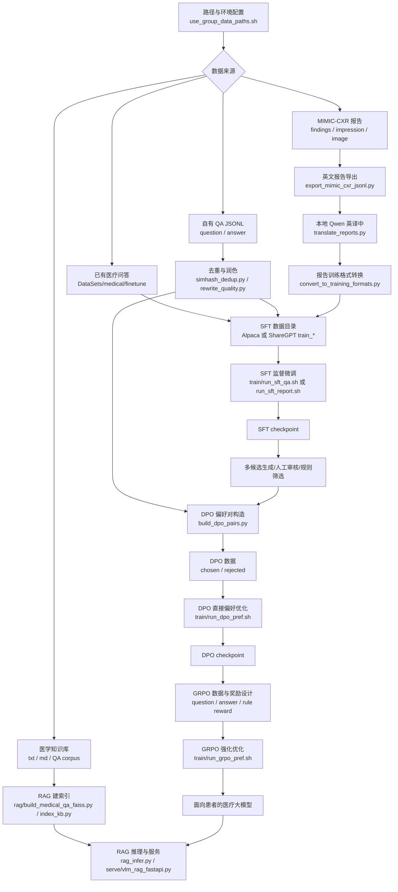

# Medical Fullstack：医疗数据处理、训练对齐与 RAG 服务

`medical_fullstack` 是 `andes_vl` 下围绕医疗大模型构建的端到端工程封装。它不直接实现底层 Trainer，而是负责把医疗问答、MIMIC-CXR 报告、偏好数据和 RAG 知识库整理成可训练/可服务的形态，并通过 `Medical_Qwen` 中的 `pretraining.py`、`dpo_training.py`、`grpo_training.py` 完成 SFT、DPO、GRPO 等训练阶段。

项目目标是训练一个**面向患者的中文医疗助手**：能用通俗语言解释医疗问题，能识别高风险症状并提醒就医，能保持医疗安全边界，不直接替代医生诊断和处方。

## 功能概览

- **医疗问答 SFT**：直接使用 `DataSets/medical/finetune` 中的 Alpaca 数据，也支持自有 `question/answer` JSONL 转 ShareGPT。
- **医学报告数据处理**：从 MIMIC-CXR 导出英文报告，使用本地 Qwen 翻译为中文，再转换为 Alpaca 或多模态 Qwen-VL 训练格式。
- **统一 CPT/SFT 封装**：`train/run_cpt_unified.sh`、`train/run_sft_qa.sh`、`train/run_sft_report.sh` 调用 `Medical_Qwen/run_pt_incremental_deepspeed.sh`。
- **DPO 偏好数据构造**：`corpus/build_dpo_pairs.py` 生成 `system/history/question/response_chosen/response_rejected` 格式。
- **DPO -> GRPO 对齐主线**：SFT 后先通过 DPO 学习患者医疗助手偏好，再通过 GRPO 强化可验证的安全、格式和行为约束。
- **RAG 与服务化**：`rag/` 支持医学 QA 检索索引和 RAG 推理，`serve/` 提供 VLM + RAG FastAPI 服务入口。
- **冒烟测试入口**：`run_medical_pipeline.sh` 提供 `prepare-smoke-sft`、`sft-smoke`、`dpo-smoke`、`grpo-smoke`、`all-smoke` 等分步命令。

## Pipeline



推荐训练主线是：

```text
数据处理 -> SFT -> DPO -> GRPO -> RAG/服务化验证
```

CPT 是可选阶段，适合在需要进一步注入领域语料分布时放在 SFT 前；RAG 是服务阶段能力增强，不替代模型训练。

## 目录结构

| 路径 | 说明 |
|:--|:--|
| `corpus/` | 数据处理脚本：MIMIC 导出、报告翻译、去重、润色、格式转换、DPO 偏好对构造 |
| `train/` | 训练封装脚本：CPT/SFT/DPO/GRPO，实际调用 `Medical_Qwen` |
| `rag/` | 医疗 QA 检索、FAISS/BM25 索引、RAG 推理与评估 |
| `serve/` | VLM + RAG FastAPI 服务入口 |
| `eval/` | JSONL 结果对比与 BLEU 类评估 |
| `data/` | 中间数据、冒烟数据、DPO/GRPO 示例数据目录 |
| `use_group_data_paths.sh` | 组内机器路径变量 |
| `run_medical_pipeline.sh` | 全流程分步/冒烟入口 |

## 环境与路径

推荐先加载组内路径变量：

```bash
source /home/notebook/data/group/guoyulong/code/image_enhance/vlm-prx/SuperResolution_train_prx/andes_vl/medical_fullstack/use_group_data_paths.sh
```

关键变量：

| 变量 | 默认含义 |
|:--|:--|
| `ANDES_VL_ROOT` | `andes_vl` 根目录 |
| `MEDICAL_FULLSTACK` | 当前 `medical_fullstack` 目录 |
| `MEDICAL_DS` | 医疗数据集目录，默认 `DataSets/medical` |
| `MIMIC_CXR_ROOT` | MIMIC-CXR 数据目录 |
| `MODEL_NAME_OR_PATH` | 基座模型或上阶段 checkpoint |
| `MEDICAL_DATA_ROOT` | `medical_fullstack/data` |

也可以使用一键脚本查看当前环境：

```bash
cd "${MEDICAL_FULLSTACK}"
./run_medical_pipeline.sh print-env
```

训练和数据导出会写入大量 checkpoint、缓存和中间 JSONL，请确保 `/home/notebook/data/group` 所在磁盘有足够空间。

## 数据处理

### 医疗问答数据

如果只做患者问答助手，最快路径是直接使用 `DataSets/medical/finetune` 中已有的 Alpaca 数据：

```bash
export TRAIN_FILE_DIR="${MEDICAL_DS}/finetune"
```

目录内文件需命名为 `train_*.json` 或 `train_*.jsonl`，字段通常为：

```json
{"instruction": "感冒发烧应该怎么办？", "input": "", "output": "建议休息、补充水分并监测体温，如持续高热或症状加重应及时就医。"}
```

自有 QA JSONL 可先做去重、润色，再转 ShareGPT：

```bash
cd "${MEDICAL_FULLSTACK}/corpus"
python simhash_dedup.py --input qa.jsonl --output qa_dedup.jsonl \
  --combine_keys question,answer --max_hamming 3 --keep longest

python rewrite_quality.py --input qa_dedup.jsonl --output qa_polish.jsonl \
  --mode llm --model_name_or_path "${MODEL_NAME_OR_PATH}"

python convert_to_training_formats.py --mode qa_sharegpt \
  --input qa_polish.jsonl \
  --output "${MEDICAL_FULLSTACK}/data/sft_qa/train_qa_sharegpt.jsonl"
```

### MIMIC-CXR 报告数据

报告链路用于构造中文医学报告生成数据，也可以为多模态训练准备图文对：

```bash
mkdir -p "${MEDICAL_DATA_ROOT}/raw" "${MEDICAL_DATA_ROOT}/clean" "${MEDICAL_DATA_ROOT}/sft_report"

python "${MEDICAL_FULLSTACK}/corpus/export_mimic_cxr_jsonl.py" \
  --dataset_root "${MIMIC_CXR_ROOT}" \
  --output "${MIMIC_REPORT_EN_JSONL}" \
  --prefer_pyarrow \
  --max_rows 100

python "${MEDICAL_FULLSTACK}/corpus/translate_reports.py" \
  --input "${MIMIC_REPORT_EN_JSONL}" \
  --output "${MIMIC_REPORT_ZH_JSONL}" \
  --model_name_or_path "${MODEL_NAME_OR_PATH}" \
  --id_key row_idx

python "${MEDICAL_FULLSTACK}/corpus/convert_to_training_formats.py" \
  --mode report_alpaca \
  --input "${MIMIC_REPORT_ZH_JSONL}" \
  --output "${MEDICAL_DATA_ROOT}/sft_report/train_mimic_report_zh.jsonl"
```

注意：`translate_reports.py` 会逐条翻译 findings 和 impression，当前没有 `--batch_size` 参数。全量 MIMIC 翻译耗时较长，建议先用 `--max_rows` 或小文件冒烟。

### 训练格式转换

`convert_to_training_formats.py` 支持以下模式：

| 模式 | 输入 | 输出用途 |
|:--|:--|:--|
| `qa_sharegpt` | `question/answer` | 医疗问答 SFT，ShareGPT `conversations` |
| `report_alpaca` | 中文报告字段 | 报告生成 SFT，Alpaca `instruction/input/output` |
| `cpt_sharegpt` | QA + 报告伪对话 | 统一 CPT/CLM 语料 |
| `cpt_qwen_vl_json` | QA/报告 + image 路径 | Qwen-VL 图文训练 JSON 数组 |

如果构造 Qwen-VL 数据，报告样本需要有效 `image`/`image_path`；纯文本 QA 与图像报告混训时，可通过 `--qa_placeholder_image` 给 QA 样本补占位图。

## SFT 训练

SFT 是主线第一步，用来让模型学习医疗问答、报告生成和患者沟通的基础格式。

问答 SFT：

```bash
cd "${ANDES_VL_ROOT}/Medical_Qwen"
export MODEL_NAME_OR_PATH="${MODEL_NAME_OR_PATH}"
export TRAIN_FILE_DIR="${MEDICAL_DS}/finetune"
export OUTPUT_DIR="${PWD}/outputs-sft-medical-qa"
export TRAIN_MODE=sft
bash "${MEDICAL_FULLSTACK}/train/run_sft_qa.sh"
```

报告 SFT：

```bash
cd "${ANDES_VL_ROOT}/Medical_Qwen"
export MODEL_NAME_OR_PATH="${MODEL_NAME_OR_PATH}"
export TRAIN_FILE_DIR="${MEDICAL_FULLSTACK}/data/sft_report"
export OUTPUT_DIR="${PWD}/outputs-sft-medical-report"
export TRAIN_MODE=sft
bash "${MEDICAL_FULLSTACK}/train/run_sft_report.sh"
```

可选 CPT：

```bash
export TRAIN_FILE_DIR="${MEDICAL_FULLSTACK}/data/cpt_unified"
export TRAIN_MODE=clm
bash "${MEDICAL_FULLSTACK}/train/run_cpt_unified.sh"
```

## DPO：患者医疗助手偏好优化

DPO 放在 SFT 之后。它优化的不是“会不会回答”，而是**同一个问题下更应该选择哪种回答**。面向患者的医疗大模型，DPO 应优先学习以下偏好：

- **医学准确性**：偏好基于医学事实、指南常识和上下文的回答，拒绝编造诊断、药物、剂量和检查结论。
- **安全分诊**：偏好能识别胸痛、呼吸困难、意识障碍、大出血、高热不退等红旗症状并建议及时就医的回答。
- **医疗边界**：偏好明确说明不能替代医生诊断和处方的回答，拒绝直接开药、承诺疗效或远程下确定诊断。
- **患者可理解性**：偏好通俗、分点、可执行的建议，拒绝术语堆砌、含混或答非所问。
- **同理心与隐私保护**：偏好温和、尊重患者、保护隐私的表达，拒绝恐吓、指责和不必要的隐私索取。

`dpo_training.py` 所需 JSONL 字段：

```json
{"system": "", "history": [], "question": "感冒发烧应该怎么办？", "response_chosen": "建议休息、补充水分并监测体温，如持续高热或症状加重应及时就医。", "response_rejected": "不用管，自己会好。"}
```

用脚本构造 DPO 数据：

```bash
cd "${MEDICAL_FULLSTACK}/corpus"
python build_dpo_pairs.py \
  --input qa_polish.jsonl \
  --output "${MEDICAL_FULLSTACK}/data/dpo/train_dpo_qa.jsonl" \
  --scenario qa \
  --mode explicit
```

`--mode explicit` 需要输入中已有 `answer_rejected` 或报告场景的 `output_rejected`。`--mode synthetic_trunc` 会用截断/噪声构造弱负例，只建议用于打通流水线，不建议作为正式医疗对齐数据。

启动 DPO：

```bash
cd "${ANDES_VL_ROOT}/Medical_Qwen"
export MODEL_NAME_OR_PATH="${PWD}/outputs-sft-medical-qa"
export DPO_TRAIN_DIR="${MEDICAL_FULLSTACK}/data/dpo"
export OUTPUT_DIR="${PWD}/outputs-dpo-medical-pref"
export DPO_MAX_STEPS=500
bash "${MEDICAL_FULLSTACK}/train/run_dpo_pref.sh"
```

常用参数由环境变量控制：`NPROC`、`DPO_BS`、`DPO_GAS`、`DPO_LR`、`DPO_MAX_STEPS`、`DPO_MAX_SRC`、`DPO_MAX_TGT`、`USE_PEFT`、`LORA_RANK`。

## GRPO：可验证行为强化

GRPO 放在 DPO 之后，用于继续强化**可计算奖励**能稳定衡量的行为。它不适合直接替代医生审核或 DPO 偏好标注，但适合约束患者医疗助手的输出结构、安全提醒和拒答边界。

当前 `Medical_Qwen/grpo_training.py` 默认包含：

- `accuracy_reward`：偏数学/标准答案验证，依赖 `math_verify` 和 LaTeX 解析。
- `format_reward`：检查输出是否符合 `<think>...</think><answer>...</answer>` 格式。

如果用于开放式医疗问答，建议扩展或替换 reward，例如：

- 红旗症状召回：问题含胸痛、卒中表现、严重过敏、孕产妇异常出血等时，奖励及时就医提醒。
- 医疗边界检查：对要求开处方、给具体剂量、解读复杂检查的问题，奖励建议线下面诊或咨询医生。
- 结构完整性：奖励包含“可能原因、建议观察、何时就医、免责声明”等模块。
- 可读性：奖励简洁分点、患者能理解的表达，惩罚冗长空泛和术语堆砌。
- 安全禁忌：惩罚危险自疗建议、延误就医建议、过度确定诊断。

GRPO 数据至少包含：

```json
{"question": "高血压患者出现胸痛怎么办？", "answer": "应警惕心血管急症，建议立即就医或拨打急救电话。"}
```

启动 GRPO：

```bash
cd "${ANDES_VL_ROOT}/Medical_Qwen"
export MODEL_NAME_OR_PATH="${PWD}/outputs-dpo-medical-pref"
export GRPO_TRAIN_DIR="${MEDICAL_FULLSTACK}/data/grpo"
export GRPO_TRAIN_SAMPLES=-1
export GRPO_EPOCHS=1
export GRPO_BS=2
bash "${MEDICAL_FULLSTACK}/train/run_grpo_pref.sh"
```

常用参数：

| 变量 | 默认值 | 说明 |
|:--|:--|:--|
| `GRPO_TRAIN_SAMPLES` | `-1` | 训练样本数，`-1` 表示全量 |
| `GRPO_BS` | `2` | 单卡 batch size |
| `GRPO_GAS` | `4` | 梯度累积步数 |
| `GRPO_LR` | `5e-7` | 学习率 |
| `GRPO_MAX_PROMPT` | `2048` | prompt 最大长度 |
| `GRPO_MAX_COMP` | `512` | completion 最大长度 |
| `QGRPO_QLORA` | `False` | 是否启用 QLoRA |
| `GRPO_4BIT` | `False` | 是否 4bit 加载 |

## RAG 与服务化

RAG 用于把外部医学知识库接入推理阶段，适合补充最新指南、院内知识库或固定医学 FAQ。

构建索引：

```bash
cd "${MEDICAL_FULLSTACK}"
KB_DIR=/path/to/kb OUT_PKL=/tmp/medical_kb.pkl ./run_medical_pipeline.sh rag-index
```

FAISS/BGE 医疗 QA 索引可参考：

```bash
python rag/build_medical_qa_faiss.py \
  --input /path/to/medical_qa.jsonl \
  --output rag/indexes/medical_qa_bge_small_zh_faiss
```

服务入口：

```bash
bash serve/run_vlm_rag_server.sh
```

更多 RAG 细节见 `rag/README_medical_qa_rag.md`。

## 一键与冒烟测试

推荐先用冒烟链路确认路径、数据格式和训练脚本都能跑通：

```bash
cd "${MEDICAL_FULLSTACK}"
./run_medical_pipeline.sh print-env
./run_medical_pipeline.sh prepare-smoke-sft
./run_medical_pipeline.sh sft-smoke
```

如果已经准备好 `data/dpo/*.jsonl`：

```bash
./run_medical_pipeline.sh prepare-smoke-dpo
export MODEL_NAME_OR_PATH="${ANDES_VL_ROOT}/Medical_Qwen/outputs-sft-medical-smoke"
./run_medical_pipeline.sh dpo-smoke
export MODEL_NAME_OR_PATH="${ANDES_VL_ROOT}/Medical_Qwen/outputs-dpo-medical-smoke"
./run_medical_pipeline.sh grpo-smoke
```

或者：

```bash
./run_medical_pipeline.sh all-smoke
```

冒烟建议：

| 阶段 | 建议 |
|:--|:--|
| MIMIC 导出 | `export_mimic_cxr_jsonl.py` 加 `--max_rows 50` |
| 翻译 | 先用小 JSONL 跑 `translate_reports.py`，不要传 `--batch_size` |
| SFT | `SMOKE_SFT_N=512` 或手动准备小 `train_smoke.json` |
| DPO | `SMOKE_DPO_N=64`、`SMOKE_DPO_STEPS=50` |
| GRPO | `GRPO_TRAIN_SAMPLES=32`、`GRPO_EPOCHS=1`、`GRPO_BS=1` |

## 常用命令速查

```bash
# 查看脚本支持的子命令
./run_medical_pipeline.sh help

# 使用已有医疗问答做 SFT
./run_medical_pipeline.sh sft

# 使用统一 CLM 数据做 CPT
TRAIN_FILE_DIR="${MEDICAL_FULLSTACK}/data/cpt_unified" ./run_medical_pipeline.sh cpt

# 使用准备好的偏好数据做 DPO
DPO_TRAIN_DIR="${MEDICAL_FULLSTACK}/data/dpo" ./run_medical_pipeline.sh dpo

# GRPO 冒烟
GRPO_TRAIN_DIR="${MEDICAL_FULLSTACK}/data/grpo_smoke" ./run_medical_pipeline.sh grpo-smoke
```

## 路径速查

| 内容 | 路径 |
|:--|:--|
| 全流程入口 | `medical_fullstack/run_medical_pipeline.sh` |
| 路径变量 | `medical_fullstack/use_group_data_paths.sh` |
| 语料脚本 | `medical_fullstack/corpus/` |
| 训练封装 | `medical_fullstack/train/*.sh` |
| RAG 脚本 | `medical_fullstack/rag/` |
| 服务脚本 | `medical_fullstack/serve/` |
| 核心训练代码 | `Medical_Qwen/pretraining.py`、`Medical_Qwen/dpo_training.py`、`Medical_Qwen/grpo_training.py` |
