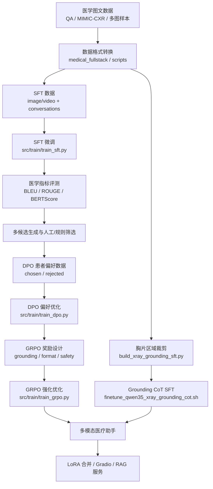

# Qwen-VL Series Finetune：多模态医疗模型微调工程

`Qwen-VL-Series-Finetune` 是面向 Qwen-VL 系列模型的多模态微调工程，支持图像、视频、多图对话、LoRA/QLoRA、DPO、GRPO、分类头训练、LoRA 合并和 Gradio 推理。本分支在通用 Qwen-VL 微调能力上，额外加入了医学混合 SFT、MIMIC-CXR 胸片报告数据、胸片区域 grounding、医学 BLEU/ROUGE 评测和患者偏好 DPO 数据构造。

本项目在 `med_omni_stack` 中的位置：

```text
med_omni_stack/
  Qwen-VL-Series-Finetune/   # 多模态 Qwen-VL 训练与评测
  medical_fullstack/         # 医疗数据处理、RAG、训练封装
  Medical_Qwen/              # 文本医疗大模型 PT/SFT/DPO/GRPO
  DataSets/                  # 组内医疗、MIMIC-CXR 等数据
```

目标模型是一个**面向患者和医学影像场景的多模态医疗助手**：能理解图像和文本上下文，生成规范中文医学回答/报告，识别胸片区域与报告描述是否一致，并在患者问答中保持安全、通俗和边界清晰。

## 功能概览

- **Qwen-VL 系列 SFT**：支持 Qwen2-VL、Qwen2.5-VL、Qwen3-VL、Qwen3.5 本地模型。
- **图像/视频/多图数据**：LLaVA 风格 `conversations`，顶层 `image` 或 `video`，文本中用 `<image>` / `<video>` 占位。
- **全参、LoRA、视觉 LoRA**：可冻结/解冻 LLM、vision tower、merger，也支持只训练部分层。
- **医学混合 SFT**：`scripts/finetune_qwen35_4b_local_medical_sft.sh` 面向医疗 QA + MIMIC 报告混合数据。
- **胸片 grounding**：从报告句子和胸片区域裁剪构造双图样本，训练模型判断“报告描述与区域是否一致”。
- **训练期医学评测**：`medical_eval_*` 参数可在保存 checkpoint 时自动运行 BLEU/ROUGE 评测。
- **DPO/GRPO**：支持通用多模态 DPO/GRPO，并提供医学患者偏好数据构造脚本。
- **LoRA 合并与推理**：提供 `scripts/merge_lora.sh` 和 `src/serve/app.py`。

## 总体流程



推荐主线：

```text
数据构造 -> SFT -> 医学评测 -> DPO -> GRPO -> 合并/推理/服务
```

胸片 grounding 是专门的医学影像增强分支，可与主线并行训练或作为后续数据增强来源。

## 目录结构

| 路径 | 说明 |
|:--|:--|
| `src/train/` | `train_sft.py`、`train_dpo.py`、`train_grpo.py`、`train_cls.py` 等训练入口 |
| `src/dataset/` | SFT/DPO/GRPO/分类数据集读取与多模态 token 处理 |
| `src/trainer/` | 自定义 Trainer，支持生成评测、LoRA 保存、不同模块学习率 |
| `src/model/` | Qwen-VL 加载、分类头、模型工具 |
| `src/serve/` | Gradio 推理服务 |
| `scripts/` | 训练、评测、数据构造、LoRA 合并脚本 |
| `output/` | 本地训练输出、评测文件、构造数据，属于运行产物 |
| `environment.yaml` / `requirements.txt` | 环境依赖 |

## 环境准备

建议使用项目依赖：

```bash
conda env create -f environment.yaml
conda activate qwen-vl-finetune
pip install -r requirements.txt
```

常用运行环境变量：

```bash
cd /home/notebook/data/group/guoyulong/code/image_enhance/vlm-prx/SuperResolution_train_prx/med_omni_stack/Qwen-VL-Series-Finetune
export PYTHONPATH="${PWD}/src:${PYTHONPATH:-}"
export MED_OMNI_STACK_ROOT="$(cd .. && pwd)"
```

训练依赖 DeepSpeed。脚本通常会从仓库根目录执行，并设置：

```bash
deepspeed src/train/train_sft.py ...
```

如果本地 Qwen3.5 系列使用 Flash Attention 2 不稳定，脚本中推荐设置：

```bash
--disable_flash_attn2 True
```

## 支持模型与训练方式

| 能力 | 说明 |
|:--|:--|
| 支持模型 | Qwen2-VL、Qwen2.5-VL、Qwen3-VL、Qwen3.5 本地 HF 权重 |
| SFT | 图像、视频、多图、多轮对话监督微调 |
| LoRA | `--lora_enable True`，可排除 `lm_head`、`embed_tokens` |
| 视觉 LoRA | `--vision_lora True`，需冻结 vision tower |
| QLoRA | 通过 `bits`、量化相关参数启用，注意 DeepSpeed/视觉模块兼容性 |
| DPO | `src/train/train_dpo.py`，多模态 chosen/rejected 偏好优化 |
| GRPO | `src/train/train_grpo.py`，可接自定义 reward |
| 分类 | `src/train/train_cls.py` |

关键参数：

| 参数 | 说明 |
|:--|:--|
| `--model_id` | 基座模型或 checkpoint 路径 |
| `--data_path` | 训练 JSON |
| `--image_folder` | 图片/视频相对路径根目录 |
| `--freeze_vision_tower` | 是否冻结视觉塔 |
| `--freeze_llm` | 是否冻结语言模型 |
| `--freeze_merger` | 是否冻结视觉-语言 merger |
| `--vision_lr` / `--merger_lr` | 视觉塔和 merger 的单独学习率 |
| `--image_min_pixels` / `--image_max_pixels` | 图像 token 数控制 |
| `--enable_reasoning` | 启用 reasoning 字段训练，适配 Qwen3.5/Thinking 模板 |

Qwen3-VL / Qwen3.5 的图像像素配置建议使用 `N * 32 * 32`；Qwen2/2.5-VL 常见配置为 `N * 28 * 28`。实际以脚本和 `src/dataset/data_utils.py` 中模型类型判断为准。

## 数据格式

### 单图 SFT

顶层 `image` 可以是相对路径、绝对路径或 URL；相对路径会与 `--image_folder` 拼接。对话文本中用 `<image>` 表示图像插入位置。

```json
[
  {
    "image": "000001.jpg",
    "conversations": [
      {
        "from": "human",
        "value": "<image>\n请描述这张胸片的主要发现。"
      },
      {
        "from": "gpt",
        "value": "双肺纹理清晰，未见明显实变影。建议结合临床症状进一步判断。"
      }
    ]
  }
]
```

### 多图 SFT

顶层 `image` 可以是数组，文本中 `<image>` 数量应和图像数量对应。

```json
[
  {
    "image": ["full_xray.jpg", "crop_right_lower_lung.jpg"],
    "conversations": [
      {
        "from": "human",
        "value": "<image>\n<image>\n第二张局部区域是否支持报告句子“右下肺可见斑片影”？"
      },
      {
        "from": "gpt",
        "value": "一致。局部区域可见可疑斑片状密度增高影。"
      }
    ]
  }
]
```

### 视频 SFT

视频样本顶层使用 `video`，文本中使用 `<video>`。

```json
[
  {
    "video": "case_001.mp4",
    "conversations": [
      {"from": "human", "value": "<video>\n请总结视频中的关键医学信息。"},
      {"from": "gpt", "value": "视频显示..."}
    ]
  }
]
```

视频也通过 `--image_folder` 作为根目录。`fps` 和 `nframes` 只能设置一个。

### Reasoning / CoT 数据

当使用 `--enable_reasoning True` 时，assistant turn 可以包含 `reasoning` 字段：

```json
{
  "image": ["full_xray.jpg", "crop.jpg"],
  "conversations": [
    {"from": "human", "value": "<image>\n<image>\n判断局部区域是否支持报告描述。"},
    {
      "from": "gpt",
      "reasoning": "先定位第二张裁剪图对应的肺野，再比较报告中的异常描述与局部影像表现。",
      "value": "一致。"
    }
  ]
}
```

当前实现会根据模型 chat template 判断是否支持 reasoning prefill。Qwen3-VL Thinking 或 Qwen3.5 相关模板更适合使用该字段。

### DPO 数据

DPO 使用多模态偏好对，通常包含 prompt、chosen、rejected 语义。实际字段以 `src/dataset/dpo_dataset.py` 为准，推荐保持与 SFT 的图像字段和对话结构一致，并在回答侧提供更优/较差响应。

面向患者医疗助手时，DPO 应偏好：

- 医学事实正确、不编造诊断和用药。
- 能识别急症信号并建议就医。
- 不替代医生诊断、处方和检查结论。
- 面向患者表达通俗、分点、可执行。
- 对影像问题能说明不确定性和需要医生/影像科确认。

## 医学混合 SFT

本地医学混合 SFT 脚本：

```bash
bash scripts/finetune_qwen35_4b_local_medical_sft.sh
```

默认路径：

| 变量 | 默认值 |
|:--|:--|
| `MODEL_DIR` | `output/qwen35_4b_medical_sft` |
| `DATA_JSON` | `../DataSets/medical/mixed_sft/train_qa_report_qwen_vl.json` |
| `IMAGE_FOLDER` | `../DataSets/mimic-cxr-jpeg-sample200` |
| `OUTPUT_DIR` | `output/qwen35_4b_medical_sft` |

该脚本会调用：

```bash
src/train/train_sft.py
```

并启用医学评测参数：

```bash
--medical_eval_bleu_steps "${SAVE_AND_EVAL_EVERY}"
--medical_eval_validation_root "${OUTPUT_DIR}/validation"
```

注意：医学评测挂在 Trainer 的 `on_save` 上，只有保存 checkpoint 时才会运行。因此 `save_steps` 应与 `medical_eval_bleu_steps` 一致，或保证保存步数能被评测步长整除。

## 胸片 Grounding SFT

胸片 grounding 分支用于训练模型判断“报告句子是否与指定胸片区域一致”。构造脚本会从报告中抽取异常句，按肺区/纵隔等区域裁剪图像，生成双图样本：

- 第一张图：完整胸片。
- 第二张图：局部区域 crop。
- 输入：报告句子 + 区域判断问题。
- 输出：一致 / 不一致，并可包含 reasoning。

构造数据：

```bash
bash scripts/build_xray_grounding_sft.sh
```

默认输出：

```text
output/xray_grounding_cot_sft.json
```

训练 LoRA：

```bash
bash scripts/finetune_qwen35_xray_grounding_cot.sh
```

质检 grounding 数据：

```bash
bash scripts/eval_xray_grounding_sft.sh
```

该分支适合增强模型的影像定位、区域解释和报告一致性判断能力。对于面向患者的应用，最终回答仍应避免直接替代影像科诊断。

## 通用 SFT / LoRA / 视频训练

全参 SFT：

```bash
bash scripts/finetune.sh
```

LoRA SFT：

```bash
bash scripts/finetune_lora.sh
```

视觉 LoRA：

```bash
bash scripts/finetune_lora_vision.sh
```

视频 SFT：

```bash
bash scripts/finetune_video.sh
```

这些脚本中的 `/path/to/your/training/data.json` 和 `/path/to/your/image/folder` 需要替换为实际数据路径。

LoRA 训练时约束：

- `--lora_enable True` 时，当前代码要求 `--freeze_llm True`。
- `--vision_lora True` 时，需要冻结 vision tower。
- 如果希望 LoRA 训练 `embed_tokens`，通常也需要同时训练 `lm_head`。

## DPO 与患者偏好数据

通用 DPO：

```bash
bash scripts/finetune_dpo.sh
```

医学患者偏好数据构造：

```bash
bash scripts/build_medical_dpo_patient_judge.sh
```

该脚本默认从医学混合 SFT 数据中构造偏好对：

| 变量 | 说明 |
|:--|:--|
| `SFT_JSON` | SFT 数据 JSON |
| `IMAGE_FOLDER` | 图像根目录 |
| `JUDGE_MODEL_PATH` | 文本 judge 模型 |
| `VL_MODEL_PATH` | SFT 后 VLM 模型 |
| `OUT_JSON` | 输出 DPO JSON |
| `MAX_SAMPLES` | 限制样本数，`0` 表示不限制 |
| `BUILD_MODE` | 默认 `hybrid` |

患者偏好建议：

- `chosen`：通俗、谨慎、指出风险、建议就医路径、承认不确定性。
- `rejected`：医生腔过重、过度确定、忽视急症、直接开药、没有安全边界。

DPO 的目标是让模型在“多个可行回答”中更偏向患者友好、安全可靠的回答，而不是单纯让回答更长。

## GRPO 与奖励函数

通用 GRPO：

```bash
bash scripts/finetune_grpo.sh
```

奖励函数位于：

```text
src/train/reward_funcs.py
```

当前包含：

- `accuracy_reward`：标准答案/数学符号验证或文本精确匹配。
- `format_reward`：检查 `<think>...</think><answer>...</answer>` 格式。
- `grounding_label_reward`：奖励 grounding 一致/不一致判断正确。
- `grounding_region_reward`：奖励提到正确解剖区域。
- `grounding_cot_format_reward`：奖励 grounding 场景中的 CoT 与最终判断格式。

面向医学多模态模型时，GRPO 更适合优化可规则验证的行为：

- 胸片 grounding 标签是否正确。
- 回答是否提到正确区域。
- 是否输出清晰的最终结论。
- 是否保留患者安全边界和就医提醒。
- 是否避免危险诊断、处方或过度确定表达。

## 评测

医学 BLEU/ROUGE 对比：

```bash
bash scripts/eval_medical_bleu_rouge.sh
```

指定 checkpoint 评测：

```bash
CHECKPOINT_DIR=output/qwen35_xray_grounding_cot_lora/checkpoint-120 \
OUT_JSON=output/eval_ckpt120_train_metrics.json \
bash scripts/eval_checkpoint_metrics.sh
```

胸片 grounding 质检：

```bash
bash scripts/eval_xray_grounding_sft.sh
```

评测指标覆盖：

- BLEU-1/2/3/4
- ROUGE-L
- BERTScore（部分 checkpoint 评测脚本支持）
- grounding label accuracy
- 人工抽查 JSON 输出

## LoRA 合并与推理

合并 LoRA：

```bash
python src/merge_lora_weights.py \
  --model-path output/testing_lora \
  --model-base Qwen/Qwen2-VL-7B-Instruct \
  --save-model-path output/merged_model \
  --safe-serialization
```

Gradio 推理：

```bash
python -m src.serve.app \
  --model-path output/merged_model
```

如果是 LoRA checkpoint，建议先合并再推理。

## 与 medical_fullstack 的衔接

`medical_fullstack` 负责数据处理和服务编排，`Qwen-VL-Series-Finetune` 负责多模态训练。常见衔接方式：

1. `medical_fullstack/corpus/export_mimic_cxr_jsonl.py` 导出 MIMIC-CXR 报告和图像路径。
2. `medical_fullstack/corpus/translate_reports.py` 翻译报告。
3. `medical_fullstack/corpus/convert_to_training_formats.py --mode cpt_qwen_vl_json` 生成 Qwen-VL 训练 JSON。
4. 本项目使用 `--data_path` 和 `--image_folder` 启动 SFT。
5. 使用本项目评测脚本或 `medical_fullstack` 的 RAG/服务模块做推理验证。

示例数据路径：

```text
../DataSets/medical/mixed_sft/train_qa_report_qwen_vl.json
../DataSets/mimic-cxr-jpeg-sample200
```

## 常用命令速查

```bash
# 医学混合 SFT
bash scripts/finetune_qwen35_4b_local_medical_sft.sh

# 构造胸片 grounding 数据
bash scripts/build_xray_grounding_sft.sh

# 训练胸片 grounding LoRA
bash scripts/finetune_qwen35_xray_grounding_cot.sh

# 评测 checkpoint 指标
bash scripts/eval_checkpoint_metrics.sh

# 构造医学 DPO 偏好数据
bash scripts/build_medical_dpo_patient_judge.sh

# 通用 DPO / GRPO
bash scripts/finetune_dpo.sh
bash scripts/finetune_grpo.sh
```

## 训练注意事项

- 大规模训练前先用小样本冒烟，确认 `data_path`、`image_folder`、`<image>` 数量和图像数量一致。
- `image` 为相对路径时，会与 `--image_folder` 拼接；如果路径不存在，会在加载阶段报错。
- 多图样本中，文本里的 `<image>` 数量应与当前 turn 使用的图像数量一致。
- Qwen3.5 本地训练建议关闭 Flash Attention 2，使用 SDPA。
- 医疗场景不建议把自动指标作为唯一标准，BLEU/ROUGE 应结合人工医学安全审核。
- 面向患者输出时，最终服务应隐藏不稳定的长 CoT，只展示简洁、安全的回答。

## Acknowledgements

本项目基于 Qwen-VL 系列、Transformers、TRL、PEFT、DeepSpeed 等生态构建，并在本地分支中扩展了医疗多模态训练、胸片 grounding 与医学评测能力。
